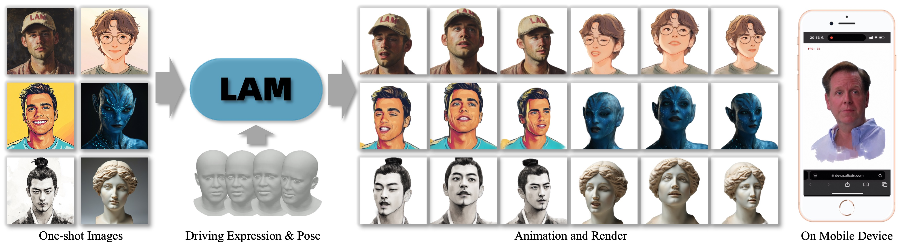

# LAM 

 

This is the source code for LAM: Large Avatar Model for One-shot Animatable Gaussian Head.

**LAM: Large Avatar Model for One-shot Animatable Gaussian Head**

  

## Code

We are working on releasing the code... 🏗️ 🚧 🔨 Please stay tuned!

- [ ] LAM-small trained on VFHQ. 
- [ ] LAM-large trained on a larger dataset.
- [ ] H5 cross-platform animation and rendering visualization platform.
